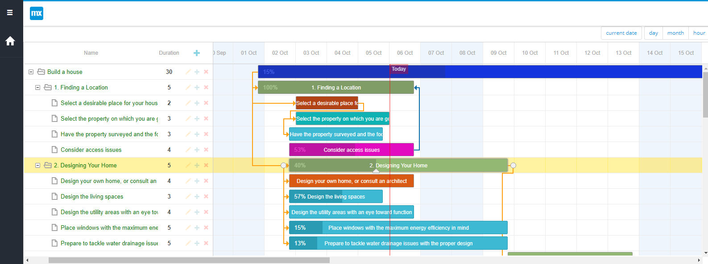
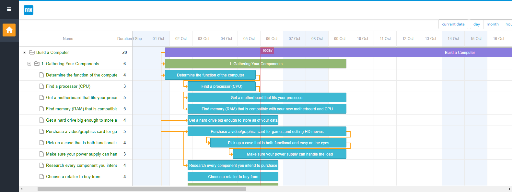
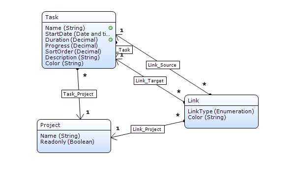

# GanttChartEditor
This code used for "Gantt Editor Application" by using GanttChartJS.

# Overview

This is the code for [this](https://appstore.home.mendix.com/link/app/93601/SCH/GanttEditor) application on Mendix Appstore by using GanttChartJS.

# Description

As one of essential component for all planning apps, Gantt Editor is used for presenting and scheduling your project, in which tasks are represented by bars and dependencies between them are modelled by lines connecting those bars.

Gantt chart are commonly used for tracking project schedules and can be seen in many project management application like: Microsoft Project, Jira, ...

 - Support Offline capability
 - Easily create task and dependencies
 - Support drag/drop task to change task’s parent
 - Support editing task and dependencies by drag/drop
 - Support adding your own tooltip information on task
 - Easy to change your chart’s appearance with many customization
 - Support a large amount of tasks

Gantt Editor allows you to track project schedules by visualizing it as a project timeline. The scale of timeline is a calendar. The duration of task is represented by bars, while dependencies are represented by arrows.

A task, by default, has name, description, start date, duration and progress. You can also choose additional information to show. A task can contain others as its subtasks. Two tasks can have one or more of these following types of dependency relationships (or links):

 - Start to start: A task must start before the other can start

 - Start to finish: A task must start before the other can finish
 
 - Finish to start: A task must finish before the other can start

 - Finish to finish: A task must finish before the other can finish

# Typical usage scenario

 - Software project development
 - Business planning

# Features and limitations

 - Easily create task and dependencies
 - Support drag/drop task to change task’s parent
 - Support editing task and dependencies by drag/drop
 - Support adding your own information about task
 - Easy to change your chart’s appearance with many customizations
 - Support a large amount of tasks

# Dependencies
 - Mendix 7.6.0 or later

# Configuration

The domainmodel will look like this:

After download from Appstore, place the widget into a dataview since it's required to have context for the widget. The widget is designed to support many possibilities of planning but you can start with minimum settings to quickly have working version and adding the rest feature later. All required configs are mandatory, without them, you will get error in Modeller.

 1. Project (entity, required): This is startpoint of everything, it should also be the entity of the dataview
    1.1 Project Name (attribute, string, required): Name of the project
    1.2 Readonly mode (attribute, boolean, optional): if true, your project will be in readonly mode, you can’t change any tasks and links.
    1.3 Show current date (boolean, optional): if true, your chart will display a vertical line to show current date. It’s true by default.
    1.4 Exclude weekend (boolean, optional): if true, it will skip weekends in calculating duration of tasks. It’s true by default.

 2. Task (entity, required): A project contains multiple tasks.
    2.1 Task Name (attribute, string, required): Name of the task, by default, it will be displayed as title of task.
    2.2 Task StartDate (attribute, DateTime, required): Start date of the task
    2.3 Task Duration (attribute, decimal, required): Duration of the task (number of days)
    2.4 Task SortOrder (attribute, decimal, required): Specify order of task among its siblings (tasks which have same parent) from top to bottom.
    2.5 Task Progress (attribute, decimal, optional): Progress of the task, a number between 0 and 1, inclusive.
    2.6 Task Description (attribute, string, optional): Description of the card
    2.7 Task Color (attribute, string, optional): Color of the task (CSS value)
    2.8 Task-Project relation (association, required): Association from Task -> Project. We use this to retrieve tasks of a project.
    2.9 Task edit form (form, optional): if configure this form, when you double click on task (or click edit task), this form will be opened.

 3. Link (entity, required): Dependency relationship between tasks
    3.1 LinkType (attribute, string, required): Type of link, it could be Finish_Finish, Finish_Start, Start_Start or Start_Finish.
    3.2 Link Color (attribute, string, optional): color of the link (CSS value)
    3.3 Link-Project (association, required): Association from Link -> Project. We use this to retrieve links of a project.
    3.4 Link-Source relation (association, required): association from link to its source (a task)
    3.5 Link-Target relation (association, required): association from link to its target (a task)
    3.6 Link edit form (form, optional): if configure this form, when you double click on link (or click edit link), this form will be opened.

 4. Task customization: Customize appearance of task
    4.1 Task text template (string, optional): a HTML template used to customize text appears on the task. To represent attribute value in this string, use placements in form of ${VARIABLE_NAME} with VARIABLE_NAME is defined in section 4.2. If left empty, the “Task name” property will be used.
    4.2 Template Variables (List, optional): The mapping of attributes to variable names for replacements in “Task text template”.
    4.3 Progress text template (string, optional): a HTML template used to customize “Task progress” property which appears in left side of the task. Use ${} to represent the progress text, which is formated as percentage. If left empty, nothing will be showed.

 5. Link customization: Customize appearance of links
    5.1 Finish-Finish link color (string, optional): CSS value for color of Finish-Finish links
    5.2 Finish-Start link color (string, optional): CSS value for color of Finish-Start links
    5.3 Start-Finish link color (string, optional): CSS value for color of Start-Finish links
    5.4 Start-Start link color (string, optional): CSS value for color of Start-Start links
    Note that, those custom colors will be overridden if you set the “Link color” property ( see in section 3.2) of a specific link.

 6. Grid customization: Customize appearance of grid
    Grid is the area appears in the left side of the chart, which contains brief information of tasks. By default, Grid has 4 columns:
    Task name: show the “Task name” property
    Start time: show the “Task StartDate” property
    Duration: show the “Task Duration” property
    Edit: contain functional button to edit/add/remove task in each row.
    6.1 Grid Column (list, optional): list of grid’s columns. Each column includes:
    Label (string, required): header of column
    Attribute (string, required): the attribute of task whose value will be display in column’s cells
    Template (string, optional): the HTML template used to display content of column’s cells. Use ${} to represent the content text.
    Type (enum, required): type of attribute, it could be String, Number or Date and time (it’s String by default).
    Width (integer, optional): width of the column
    Align (enum, optional): Alignment of the column, it could be left, right or center
    6.2 Row height (integer, optional): height of the grid’s rows. Note that, the task’s height depends on this value.

 7. Context menu customization
    Context menu will appear when right-click on tasks or links. By default, context menu has “Edit” and “Delete” item.
    7.1 Edit (boolean, optional): Decide if context menu has “Edit” item. When click on this item, the edit form will be opened
    7.2 Delete (boolean, optional): Decide if context menu has “Delete” item. When click on this item, the task/link will be deleted
    7.3 Task Context Menu (list, optional): Define more items in tasks’ context menu. Each item includes:
    Label (string, required): title of the item
    Microflow (microflow, required): the microflow will be called when click on the item
    In addition, Gantt Editor has several utilities to help you experience your chart better:

    “Current Date” button: Jump to current date in timeline

    “Scale unit” button: Select scale unit: Day, Month or Hour